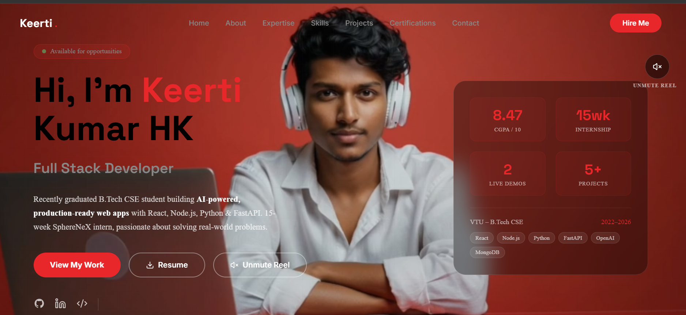
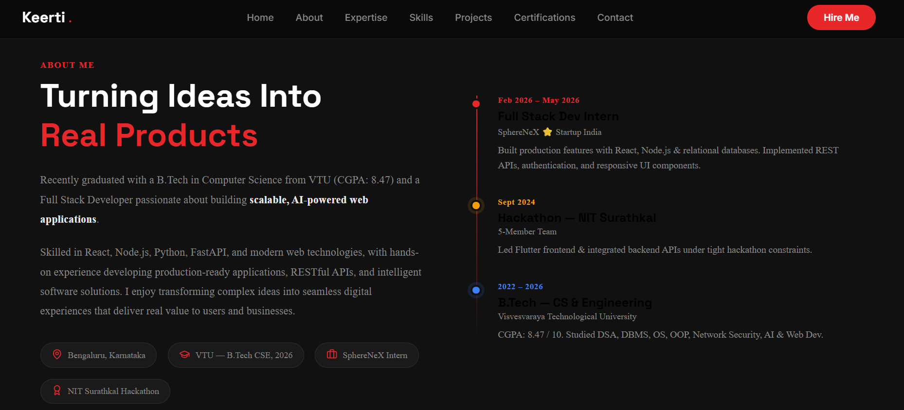

<div align="center">

# ⚡ Keerti Kumar HK — Personal Portfolio

### Full Stack Developer · Python Engineer · AI-Integrated Applications

[](https://portfolio-git-main-keertikumar-h-ks-projects.vercel.app/)
[](https://www.linkedin.com/in/keertikumar-h-k-363a88327/)
[](https://github.com/Keertikumar-H-K)

**[➜ Live Site: https://portfolio-git-main-keertikumar-h-ks-projects.vercel.app](https://portfolio-git-main-keertikumar-h-ks-projects.vercel.app/)**

</div>

---

## 🖥️ Preview

 


 



| Section | What's Inside |
|---------|--------------|
| Hero | Animated typewriter · Stats card · Intro video modal |
| About | Timeline — Internship → Hackathon → Education |
| Expertise | 6 skill domains with hover cards |
| Skills | Tabbed animated progress bars |
| Projects | Filterable cards with Live & GitHub links |
| Certifications | SphereNeX · Udemy · Hackathon badge |
| Contact | EmailJS form — instant delivery, no backend needed |

---

## 🏗️ Tech Stack

### Frontend
| Tech | Purpose |
|------|---------|
| **React.js** | UI framework |
| **Vite** | Build tool & dev server |
| **Lucide React** | Icon library |
| **EmailJS** | Contact form — browser-to-email, no backend |
| **CSS Variables** | Theming (dark mode, red accent) |
| **Intersection Observer API** | Scroll-triggered animations |

### Backend (optional — contact form uses EmailJS instead)
| Tech | Purpose |
|------|---------|
| **Node.js + Express** | API server |
| **Nodemailer** | Email via Gmail SMTP |
| **Render** | Hosting |

---

## 📁 Project Structure

```
keertikumar-portfolio/
│
├── 📂 src/
│   ├── 📂 components/
│   │   ├── Navbar.jsx          # Fixed nav with scroll detection
│   │   ├── Hero.jsx            # Typewriter · stats · intro video modal
│   │   ├── About.jsx           # Bio + experience timeline
│   │   ├── Expertise.jsx       # 6 expertise cards with hover effects
│   │   ├── Skills.jsx          # Tabbed skill bars + tech badges
│   │   ├── Projects.jsx        # Filterable project showcase
│   │   ├── Certifications.jsx  # Certs + hackathon highlight
│   │   ├── Contact.jsx         # EmailJS contact form
│   │   └── Footer.jsx
│   ├── App.jsx
│   └── index.css               # Global styles + CSS variables
│
├── 📂 backend/                 # Optional Express backend
│   ├── server.js
│   ├── .env.example
│   └── package.json
│
├── 📂 public/
│   ├── intro-video.mp4         # ← Add your intro video here
│   └── 📂 projects/            # ← Add project screenshots here
│       ├── code-editor.png
│       ├── ai-fitness.png
│       ├── yogaalign.png
│       ├── indiancafe.png
│       └── taskhub.png
│
├── .gitignore
└── package.json
```

---

## 🚀 Local Setup

### 1. Clone the repository

```bash
git clone https://github.com/Keertikumar-H-K/portfolio-.git
cd portfolio-
```

### 2. Install dependencies

```bash
npm install
```

### 3. Set up EmailJS (contact form)

1. Sign up free at [emailjs.com](https://emailjs.com)
2. Add a Gmail service → copy **Service ID**
3. Create a Contact Us template → copy **Template ID**
4. Account → General → copy **Public Key**
5. Paste all three into `src/components/Contact.jsx`:

```js
const EMAILJS_SERVICE_ID  = 'service_xxxxxxx'
const EMAILJS_TEMPLATE_ID = 'template_xxxxxxx'
const EMAILJS_PUBLIC_KEY  = 'xxxxxxxxxxxxxxx'
```

### 4. Run locally

```bash
npm run dev
# http://localhost:5173
```

---

## 📧 Contact Form Flow

```
User fills form
      ↓
EmailJS API (browser → Gmail directly)
      ↓
Email delivered to keertikumar543@gmail.com ✅
      (no backend, no cold start, instant)
```

---

## 🌐 Deployment

### Frontend → Vercel

```bash
npm i -g vercel
vercel --prod
```

Or connect GitHub repo on [vercel.com](https://vercel.com) — auto-deploys on every push.

### Backend → Render (optional)

1. [render.com](https://render.com) → New Web Service → connect repo
2. Root Directory: `backend` · Build: `npm install` · Start: `npm start`
3. Add environment variables:
```
EMAIL_USER   = keertikumar543@gmail.com
EMAIL_PASS   = your_gmail_app_password
FRONTEND_URL = https://portfolio-git-main-keertikumar-h-ks-projects.vercel.app
PORT         = 5000
```

---

## 🎨 Customisation

| What | File | How |
|------|------|-----|
| Name / bio | `Hero.jsx`, `About.jsx` | Edit text |
| Project links | `Projects.jsx` | Update `github:` and `live:` fields |
| Project images | `public/projects/` + `Projects.jsx` | Add file + set `image:` field |
| Intro video | `public/intro-video.mp4` | Drop file in |
| Color scheme | `src/index.css` | Change `--red` CSS variable |
| Social links | `Hero.jsx`, `Contact.jsx` | Update `href` values |
| EmailJS keys | `Contact.jsx` | Top 3 constants |

---

## 📦 Adding Project Screenshots

```jsx
// In Projects.jsx, find your project and add:
{
  title: 'CodeSync',
  image: '/projects/code-editor.png',  // ← add this line
  ...
}
```

---

## 📄 License

MIT © 2026 Keerti Kumar HK

---

<div align="center">

**⭐ If this helped you, consider starring the repo!**

Made with ❤️ by [Keerti Kumar HK](https://github.com/Keertikumar-H-K)

</div>